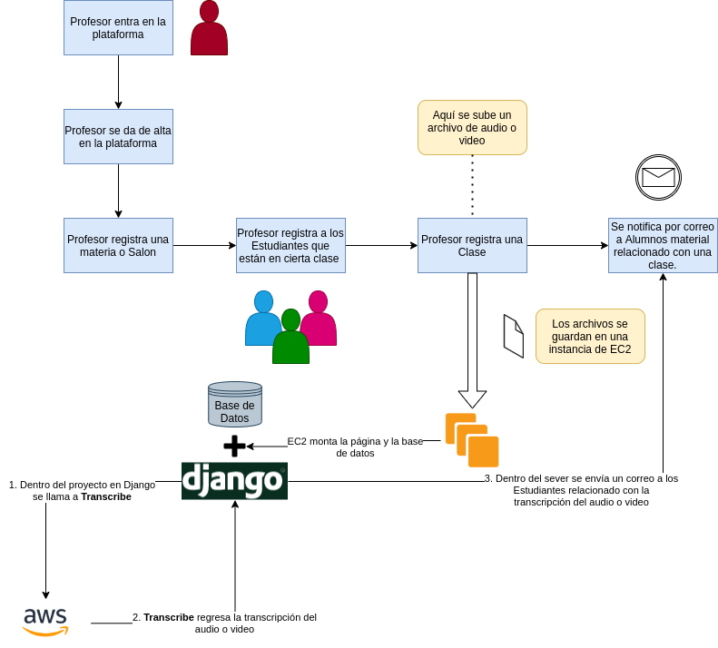

# Hackaton

## Integrantes del equipo

José Andrés Carlos Lopez 

Edwin Hazel Chávez Martínez @github/edwinhazel

Andoni Aarón Reyes Rodríguez @github/eersya

Antonio Alvarez

## Funcionamiento

##  Herramientas ocupadas

1. Django
   - Django Tweaks Widgets
	
## Descripción del proyecto en Django

1. Ayudante: Nombre del proyecto 
- gestor: Aplicación de Django para administrar los temas de la clase y estudiantes, en cada clase se pueden subir videos y medeiante las herramientas que vimos en los cursos de Amazon AWS, se generan cuestionarios y bibliografía para profundizar los temas que se tocan en cada clase qu se sube.

## Descripción del proyecto en AWS

Almacenamiento de datos proporcionado por Docentes y Alumnos a traves de los servidores de AWS para su procesamiento y analisis en tiempo real, utilizando herramientas como Aurora y Kinesis para llevar la estadistica en tiempo real de los Estudiantes. Supervisar el rendimiento de los usuarios a través de un **Aula Virtual**. Esta App busca ser una herramienta de entorno amigable, inclusiva y de facíl manejo. 

¿Cómo pueden ver los encargados del curso el rendimiento de los integrantes del **Aula Virtual** conforme avanza el curso?

### Encargado del curso

*Cuestionarios en tiempo real*. Prepara y lanza preguntas a los integrantes del Aula y con ello sacar una estadistica en tiempo real con *Kinesis Data Stream* y *KInesis Data Analytics*, recursos con los cuales podrá tener un mejor monitoreo de aprendizaje en curso. 

*Estadisticas de los participantes*. Extrae información desde la nube para su posterior analísis, ahorrando tiempo al momento de las evaluaciones y ocupandose de lo realmente importante, el aprendizaje 

### Participantes del curso

Busca información de manera más facil y rapida gracias a herramientas como *Kibana*. Analiza la clase de forma más eficiente con el buscador de texto del video. Busca entre las palabras clave que *Kibana* ha extraido del video/audio que los profesores suben a la plataforma. 

### Requesitos para el proyecto
1. Django
- dejango-widget-tweaks
2. AWS
- CloudFormation
- S3
- EC2
- Transcribe
- RDS
	* Aurora
- Kinesis Data Stream

